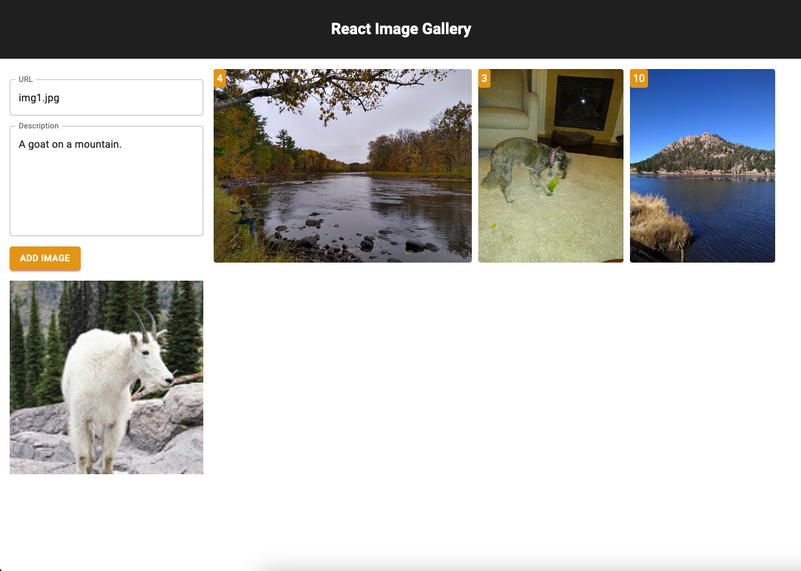

# React Image Gallery

## Description

*Duration: 2 days*

This project is a simple image gallery. Users can store images with descriptions and like other peoples images. It was created in a weekend for the Full Stack Engineering course at [Prime Digital Academy](https://www.primeacademy.io/).

## Installation

### Pre-Requisites

- install [node.js](https://nodejs.org)
- install [postgresql](https://www.postgresql.org/)

### Steps

1. clone the repository to your local machine.
2. create a database on `localhost:5432` and follow the instructions in the `database.sql` file to populate it with some starter data.
3. open up a terminal window and run `npm install` to install the dependencies.
4. in the same terminal window run `npm run server`.
5. open up your web browser and go to `localhost:5000` to use the site.

## Support

If you have any questions please email me [here](mailto:davey.meuer@gmail.com)